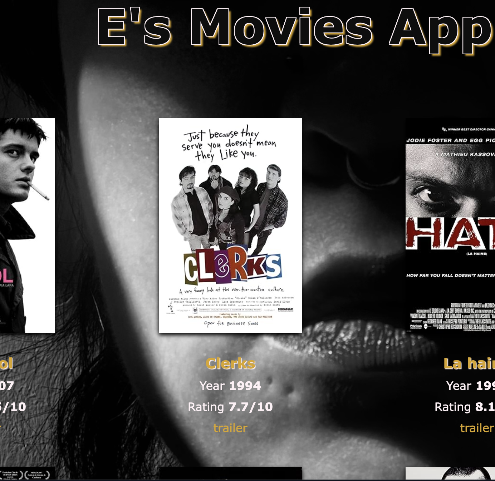

# °°°°°°°°°° Salut, here's E's movies app °°°°°°°°°°

## Description
This is a simple yet specialized movie database application with a focus on black-and-white films. The application allows users to manage their collection of classic and modern black-and-white movies. Users can add, delete, update, and search for these films with ease. The app integrates with the OMDb API to fetch detailed information about movies, including title, year, rating, and poster image.
## Features
- List All Movies: View a list of all the black-and-white movies in your collection.

- Add New Movies: Add a new movie to your collection by searching for its title using the OMDb API.

-  Delete Movies: Remove a movie from your collection.

- Update Movie with Notes: Add or update notes about a movie in your collection.

- Search Movies by Name: Find movies in your collection by searching for part of the title.

- Display Random Movie: Get a random movie suggestion from your collection.

- Show Movie Statistics: Display statistics about your collection, such as average rating, median rating, best and worst movies.

- Movies Sorted by Rating: View your movies sorted by their rating in descending order.

- Generate a Website: Create an HTML webpage to showcase your movie collection.

## Requirements
- Python 3.x
- `requests` library for API calls
- `python-dotenv` for environment variable management

## Installation:

- Clone the Repository:

    git clone <repository-url>

    cd <repository-directory>

- Install Dependencies:

    pip install -r requirements.txt

- Set Up the Environment:

* Create a .env file in the project root and add your OMDb API key:

    API_KEY=your_omdb_api_key_here

- Run the Application:

    python main.py

## Usage
Upon running the application, a menu will be displayed allowing you to choose from various options like listing all movies, adding new ones, deleting, updating, and more. You can interact with the application via the terminal.

## and enjoy, my dear(s)